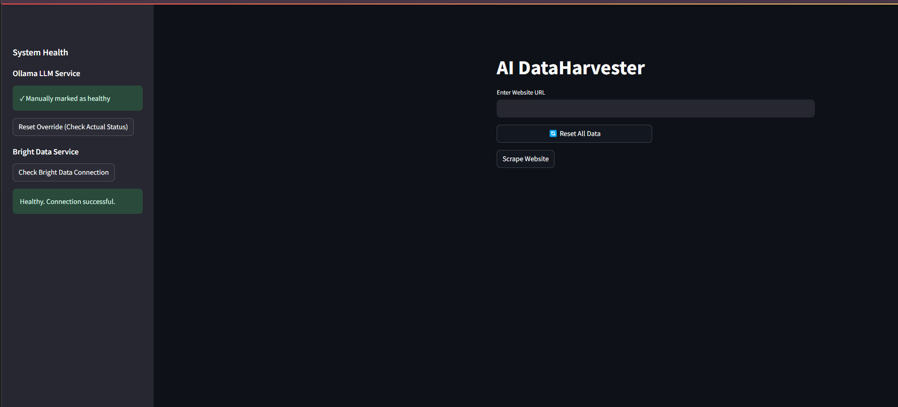

<div align="center">
  
  <h1 style="font-size: 52px;">AI DataHarvester</h1>
</div>

An intelligent web content extraction application that uses natural language processing to transform web scraping into precise data harvesting.

## 🎯 Overview

AI DataHarvester combines the power of local LLMs (Large Language Models) with web scraping technologies to create an intelligent data extraction tool. Unlike traditional web scrapers that simply download content, this application understands what you're looking for and extracts specifically requested information using natural language queries.

## 📸 Screenshots

### 📊 AI DataHarvester - Concept Illustration
<p align="center">
  
</p>

### 🔍 Application Header
<p align="center">
  
</p>

### 🛡️ Health Monitoring
<p align="center">
  
</p>


## ✨ Features

### 🔍 Intelligent Web Extraction
- Extract specific information from websites using natural language
- Process and clean web content automatically
- Handle various website structures and formats

### 🧠 AI-Powered Parsing
- Use local LLMs to understand your queries
- Extract precisely what you need from web content
- Support for multiple LLM models (llama3.2, gemma, mistral, phi3, etc.)

### 🔄 Data Management
- Reset functionality to quickly start new projects
- Store extracted content in session for further processing
- View and analyze raw content before extraction

### 💾 Export Options
- Download parsed results as structured JSON files
- Send data directly to webhooks for integration with other systems
- Well-formatted data with timestamps and metadata

### 🛡️ Health Monitoring
- Real-time monitoring of system components
- Status indicators for LLM service and web scraping service
- Troubleshooting guidance and quick fixes

### 🐳 Containerization
- Docker-based deployment for consistent environment
- Multi-container setup with orchestration
- Volume persistence for logs and data

## 📂 Project Structure

```
ai-dataharvester/
├── .github/                  # GitHub workflows and CI/CD configuration
│   └── workflows/            # CI/CD workflow definitions
│       └── deploy.yml        # Deployment workflow
│
├── logs/                     # Application logs directory
│   ├── scraper.log           # Web scraping logs
│   ├── parser.log            # LLM parsing logs
│   ├── streamlit.log         # UI application logs
│   └── health.log            # Health monitoring logs
│
├── .env                      # Environment variables (credentials)
├── .gitignore                # Git ignore rules
├── docker-compose.yml        # Docker Compose configuration
├── Dockerfile                # Docker image definition
├── README.md                 # Project documentation
├── requirements.txt          # Python dependencies
├── setup.sh                  # Setup script for directory structure
│
├── main.py                   # Main Streamlit application
├── scrape.py                 # Web scraping functionality
├── parse.py                  # LLM parsing functionality
├── health.py                 # Health monitoring system
└── logger_config.py          # Centralized logging configuration
```

## 🚀 Getting Started

### 📋 Prerequisites

- Ubuntu Desktop system
- Python 3.11
- Git
- Ollama already running locally

### 🔧 Local Installation

1. **Install Python 3.11** (if not already installed):
   ```bash
   sudo apt install python3.11
   sudo apt install python3.11-venv
   ```

2. **Clone the repository**:
   ```bash
   # Navigate to your preferred installation directory
   cd /path/to/your/preferred/directory
   git clone https://github.com/yourusername/ai-dataharvester.git
   cd ai-dataharvester
   ```

3. **Create and activate a Python virtual environment**:
   ```bash
   python3.11 -m venv ai
   source ai/bin/activate
   ```

4. **Install the required dependencies**:
   ```bash
   pip install -r requirements.txt
   ```

5. **Create needed directories** (if they don't exist):
   ```bash
   mkdir -p logs
   ```

6. **Create an .env file** for your credentials:
   ```bash
   touch .env
   nano .env
   ```
   Add these lines to the file (replace with your actual credentials):
   ```
   BRIGHTDATA_USER=your_brightdata_user
   BRIGHTDATA_PASSWORD=your_brightdata_password
   ```
   Save and exit (Ctrl+X, then Y, then Enter)

### 🐳 Docker Installation

1. **Build and start the containers**:
   ```bash
   docker-compose up -d
   ```

2. **Access the application** at http://localhost:8501

## 🎮 Running the Application

1. **Ensure your Ollama instance is running**

2. **Activate the virtual environment** (if not already activated):
   ```bash
   source ai/bin/activate
   ```

3. **Start the Streamlit application**:
   ```bash
   streamlit run main.py
   ```

4. **Access the application** by opening a web browser and navigating to:
   ```
   http://localhost:8501
   ```

## 🎮 Usage

### 🌐 Scraping a Website
1. Enter a website URL in the input field
2. Click "Scrape Website" and wait for the process to complete
3. The content will be extracted, cleaned, and stored for parsing

### 🔎 Parsing Content
1. With scraped content loaded, enter a natural language query
   - Example: "What is the main topic of this website?"
   - Example: "Extract all product names and prices"
   - Example: "Find the author's contact information"
2. Select your preferred LLM model
3. Click "Parse Content" to extract the specific information

### 📊 Managing Results
1. View the parsed results directly in the interface
2. Download the results as a JSON file using the download button
3. Send the results to a webhook for integration with other systems
4. Reset all data when starting a new project

## 🏗️ Architecture

The application consists of two main components:

1. **ai-dataharvester**: Streamlit application for UI and web scraping
   - Handles user interactions
   - Performs web scraping via Bright Data
   - Processes and cleans content
   - Manages the parsing workflow

2. **ollama**: Local LLM service for content parsing
   - Provides inference capabilities
   - Supports multiple models
   - Performs natural language understanding
   - Extracts specific information based on queries

### 🔄 Data Flow

```
User Request → Streamlit UI → Web Scraping (Selenium/Bright Data) → Content Cleaning
                                                                       ↓
     JSON Export/Webhook ← Result Display ← LLM Parsing (Ollama) ← Content Processing
```

## 📝 Logging and Monitoring

Comprehensive logging system with files stored in the `logs/` directory:

- `scraper.log` - Web scraping operations and errors
- `parser.log` - LLM parsing activities and responses
- `streamlit.log` - UI and application flow
- `health.log` - Health check information and system status

Health monitoring is available in the sidebar of the application, providing:
- Real-time status of the Ollama LLM service
- Connection status for Bright Data service
- Troubleshooting guidance for common issues
- Manual override options for development

## 🔧 Troubleshooting

If you encounter issues:

1. Check the application logs in the `logs/` directory
2. Verify the health status in the application sidebar
3. Ensure your Bright Data credentials are correct in the `.env` file
4. Make sure the Ollama service is running
5. Try restarting the application

### Configuring Ollama Connection

By default, the application connects to Ollama at `http://localhost:11434`. If your Ollama instance is running at a different address:

1. Add the `OLLAMA_HOST` variable to your `.env` file:
   ```
   OLLAMA_HOST=http://your-ollama-host:11434
   ```

2. For troubleshooting Ollama connection issues:
   - Check that Ollama is running using `ollama list` in terminal
   - Verify your Ollama API is accessible at the configured address
   - Make sure you have the required models installed (`llama3.2`, etc.)

Common solutions:
- Reset the application data if encountering UI issues
- Check network connectivity for webhook and scraping operations
- Verify that required LLM models are downloaded in Ollama

## 🔒 Security Notes

- Credentials are stored in environment variables, not hardcoded
- Webhook connections use HTTPS for secure data transmission
- Logs are segregated by component for better auditing

## 🤝 Contributing

Contributions are welcome! Please feel free to submit a Pull Request.

## 📜 License

Copyright (c) 2025 [David Urdiales]

This project is licensed under the MIT License

## 🙏 Acknowledgments

- Streamlit for the UI framework
- Ollama for local LLM capabilities
- Bright Data for web scraping infrastructure
- Selenium for browser automation
- LangChain for LLM integration
